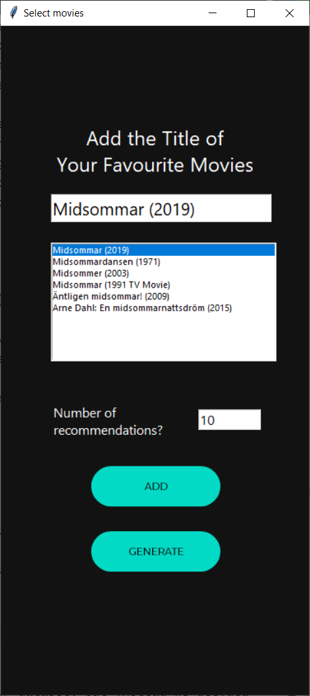
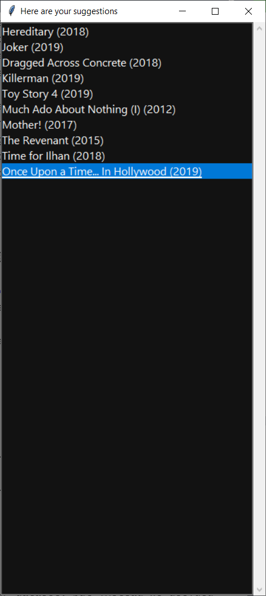

# Movie Recommender App

## **About** 
* This project was done for University of Toronto's CSC111 course. It involves using the graph data structure and related algorithms to generate reccomendations of movies using 'movie review' data from different users. More information can be found in the project report pdf ([Project Report](https://github.com/rafeerahman/Movie-Recommender-System-App/blob/main/report/project_report.pdf)). 

## **Instructions**
* See the bottom of page 3 in the project report ([Project Report](https://github.com/rafeerahman/Movie-Recommender-System-App/blob/main/report/project_report.pdf)) for full instructions on how to run this program.

## **Example use-case using a list of horror movies**

  
  
  

## **Visualization of a subset of our graph**

